# Human-Centered Cloud Migration Framework 🏛️☁️

> Design Thinking + AI-powered tools for DORA-compliant banking cloud migration

## 🎯 The Problem
Traditional banks face significant delays in cloud migrations due to communication gaps between technical teams and regulatory officers, leading to extended timelines and increased project risks.

## 💡 Our Solution
This framework combines human-centered design principles with AI-powered tools to create seamless, DORA-compliant cloud migrations that work for both technical and compliance teams.

## 👥 Core Personas
- **Michael**: Compliance Manager (needs transparency and auditability)
- **Sarah**: Cloud Engineer (needs efficiency and automation)

[📖 Detailed Persona Profiles](docs/framework/personas.md)

## 🤖 AI-Powered Tools Suite
1. **DORA Compliance Translator** - Converts technical configurations into audit-ready compliance language
2. **Smart Dependency Mapper** - Visualizes legacy system dependencies for safer migrations
3. **Real-time Compliance Scanner** - Continuous DORA compliance monitoring
4. **Migration Sandbox** - Safe testing environment for worst-case scenarios
5. **MigraMentor Chatbot** - 24/7 support with banking-specific knowledge

[🔧 Complete AI Tools Architecture](docs/framework/ai-tools-overview.md)

## 🏛️ Governance Framework
- **Ethical AI Governance Board** - Ensures bias-free AI decisions
- **Mobile Companion App** - Stress monitoring and personalized learning

## 📋 Getting Started

### 1. Assess Your Readiness
Use our comprehensive checklist to evaluate your institution's readiness for human-centered cloud migration:
- [📊 Readiness Assessment Checklist](tools/assessment/readiness-checklist.md)

### 2. Plan Your Implementation  
Follow our proven roadmap for successful framework adoption:
- [🗺️ Implementation Roadmap Template](tools/templates/implementation-roadmap.md)

### 3. Understand the Process
Review our detailed migration workflow:
- [⚙️ 9-Phase Migration Process](docs/framework/migration-process.md)

## 📊 Expected Benefits
- ✅ Accelerated migration timelines
- ✅ Enhanced compliance readiness  
- ✅ Improved cross-team collaboration
- ✅ Reduced migration stress and errors

## 🚀 Use Cases
Perfect for:
- Traditional banks modernizing legacy systems
- Financial institutions requiring DORA compliance
- IT teams bridging technical and regulatory requirements
- Organizations seeking human-centered digital transformation

## 📖 Documentation

### Framework Core
- [👥 Detailed Personas](docs/framework/personas.md) - Michael & Sarah profiles with goals, pain points, and daily challenges
- [⚙️ Migration Workflow](docs/framework/migration-process.md) - Complete 9-phase process with decision gates
- [🤖 AI Tools Architecture](docs/framework/ai-tools-overview.md) - Technical specifications and integration details

### Practical Tools
- [📊 Readiness Checklist](tools/assessment/readiness-checklist.md) - Self-assessment for institutional readiness
- [🗺️ Implementation Roadmap](tools/templates/implementation-roadmap.md) - Step-by-step deployment guide

### Case Studies & Examples  
- [📚 Banking Use Case](docs/guides/use-case.md) - Detailed implementation example with results

### Visual Architecture
- [🔄 Complete System Diagram](diagrams/complete-system.svg) - Full framework visualization
- [👤 Persona Journeys](diagrams/personas-journey.mmd) - User experience flows

## 🤝 Contributing
We welcome contributions from the banking and cloud migration community!

Open an [Issue](../../issues) to:
- 💡 Share your banking migration experiences
- 🔧 Suggest improvements to personas or workflows  
- 🌍 Contribute compliance requirements for different regions
- 📊 Propose new assessment tools or metrics

## 🎯 Roadmap
- [ ] Multi-cloud provider adaptations (AWS, GCP)
- [ ] Extended compliance frameworks (Basel III, SOX)
- [ ] Industry-specific adaptations (insurance, credit unions)
- [ ] Academic research partnerships
- [ ] Community case study collection

## 📄 License
This framework is released under the [MIT License](LICENSE) to encourage adoption and contribution from the banking community.

---
*Developed for the banking community to accelerate human-centered cloud transformation*

**⭐ If this framework helps your institution, please star the repository and share your experience!**
