# Human-Centered Cloud Migration Framework 🏛️☁️

> Design Thinking + AI-powered tools for DORA-compliant banking cloud migration

## 🎯 The Problem
Traditional banks face significant delays in cloud migrations due to communication gaps between technical teams and regulatory officers, leading to extended timelines and increased project risks.

## 💡 Our Solution
This framework combines human-centered design principles with AI-powered tools to create seamless, DORA-compliant cloud migrations that work for both technical and compliance teams.

## 👥 Personas
- **Michael**: Compliance Manager (needs transparency and auditability)
- **Sarah**: Cloud Engineer (needs efficiency and automation)

## 🤖 AI Tools
1. **DORA Compliance Translator** - Converts technical configurations into audit-ready compliance language
2. **Smart Dependency Mapper** - Visualizes legacy system dependencies for safer migrations
3. **Real-time Compliance Scanner** - Continuous DORA compliance monitoring
4. **Migration Sandbox** - Safe testing environment for worst-case scenarios
5. **MigraMentor Chatbot** - 24/7 support with banking-specific knowledge

## 🏛️ Governance Framework
- **Ethical AI Governance Board** - Ensures bias-free AI decisions
- **Mobile Companion App** - Stress monitoring and personalized learning

## 📊 Expected Benefits
- ✅ Accelerated migration timelines
- ✅ Enhanced compliance readiness
- ✅ Improved cross-team collaboration
- ✅ Reduced migration stress and errors

## 🚀 Use Cases
Perfect for:
- Traditional banks modernizing legacy systems
- Financial institutions requiring DORA compliance
- IT teams bridging technical and regulatory requirements

## 🤝 Contributing
Open an [Issue](../../issues) to:
- Share your banking migration experiences
- Suggest improvements to personas or workflows
- Contribute compliance requirements for different regions

## 📖 Documentation
- [Detailed Personas](personas.md)
- [Migration Workflow](migration-process.md)
- [AI Tools Architecture](ai-tools-overview.md)

---
*Developed for the banking community to accelerate human-centered cloud transformation*
